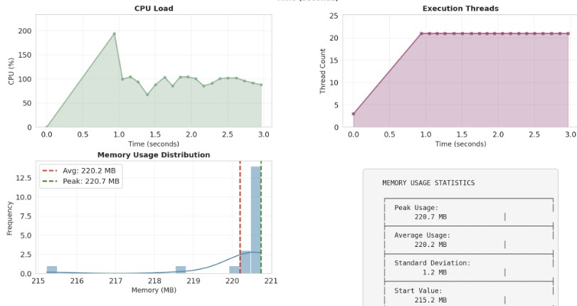
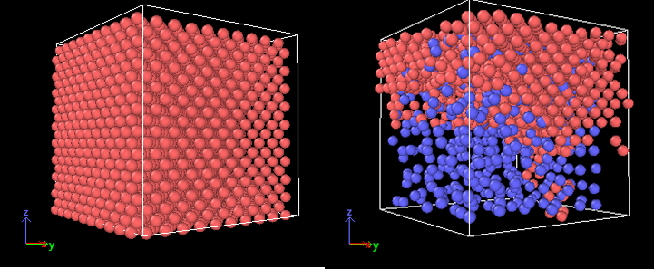

# fast-lammps extension

This tool allows to dramatically speed up your molecular dynamics simulations using dynamic coarse-graining algorithm. 
The example of the processes which were approximated with this extension^ heating aurum. The blocks where kinetic energy was lower than the threshold were approximated with larger particles (atoms).
1. [How does it work?](#how-does-it-work)
2. [Installation](#installation)
3. [Example](#example-of-usage-with-ready-made-mesh-refinement)
4. [Advanced usage with your own mesh-refinement](#advanced-usage-with-your-own-mesh-refinement)
5. [Pipeline of launch the script on supercomputer](#pipeline-of-the-supercomputer-experiment-with-fast-lammps)


## Getting started quickly
### How does it work?
This package speeds up ready molecular dynamics scripts and simulations, written on LAMMPS or ASE package. The only thing you need is to provide the initial conditions script in ``.in`` format to test-drive how fast your simalutions would become.


### Installation
You will need to **run all scripts with this package in the virtual environment of lammps module**.

1. Clone the repository:
```
git clone git@github.com:IlyaPer/fast-lammps.git
cd fast-lammps
```

2. Setup package:
```
python setup.py
```

3. Instalation dependencies:
```
pip install -r requirements.txt
```

#### Brief introduction into the functionality of the package

Obligatory command-line arguments:  
- `-f <file>` — path to the input file of the simulation in the `.in` format.
- `--solver <type  o fsolver>` — default is *fcc*. Another available are described in documentation.
- `-i <iterations>` — maximum number of iterations.
- `-m <step>` — step of coarse‑graining (default: 500; adaptive if possible?).
- `-k <size of cell to be grained>` — must be even. if 0 - no coarse graining would be provided, so the simulation would continue as it is. 0 is useful if you need other tools of the package (visualizing prometheus metrics with Grafana, for instance).

Additional command-line arguments:  
- `--system_checkup` — with this flag enabled you will obtain CPU/GPU/Memory allocations data in any format, ready to be visualized with Grafana or in ready-made jpg plots.

- `--experiment` — with this flag you will receive comparsion between CPU/GPU/Memory allocations data with dynamic coarse-graining and without it, available to be visualized in Grafana tool. This flag utomatically enables `--system_checkup`.
- `--stress` — with this flag you will receive maximum possible memory/gpu/cpu consumption with synthetically made conditions (such as all regions to be grained simultaneously or retrieving extreme forces). If the simulation ended up successfully with this flag enabled - you would probably not receive any overflow errors from our side on your supercomputer run.
- `--reversed_graining` — This is an advanced tool which allows to setip several conditions to (1) approximate a group of atoms with one particle, as works with simple run (2) provide reverse-graining, if the approximated region is involved into an "interesting" process, where high precision is required. This allows to use package for simulating highly uncertain processes, where there is no assumptions on where the process will be interesting
 - `--analyze` — This is an advanced flag which allows to recieve information on how many resources is going to be required for running your simulation. It is running by it's own and doen't require any additonal flags except for `-f`. It provides information in a table format. This tool is needed if you run your simulation on a supercomputer and you are planning to count required CPU/GPU units.

Example of simple usage
```
python main.py -f 'heating_aurum.in' --solver fcc -i 10000 -m 500
```


### Example of usage with ready made mesh-refinement
If you need to speed up simulation with fcc structures - use `--solver fcc`. It is described in our documentation and it is resistant to fluctations during running simulation.

Example of advanced usage with experiments  
```
python main.py -f 'heating_aurum.in' --solver fcc --system_checkup --experiment -i 10000 -m 500
```

*do not forget to activate lammps environment before launching the script!*

The result: during simulation dcc supercells are approximated with quazi-atoms.



## Advanced usage with your own mesh-refinement
Ready made mesh-refinement solutions are described in our documentation. Currently, only fcc structures are available to be grained or layer substitution. However, you can easily integrate your own solver for extracting regions to be approximated and conditions to choose regions to be grained.

## Pipeline of the supercomputer experiment with fast-lammps

Package provides several useful tools for launching your already made simulation on supercomputer cluster with dynamic coarse graining.

1. Check up possible overflow issues with `--stress` flag
2. Run the flag experiment with `--experiment` flag.
3. Choose `--autodetect` to identify best way to  